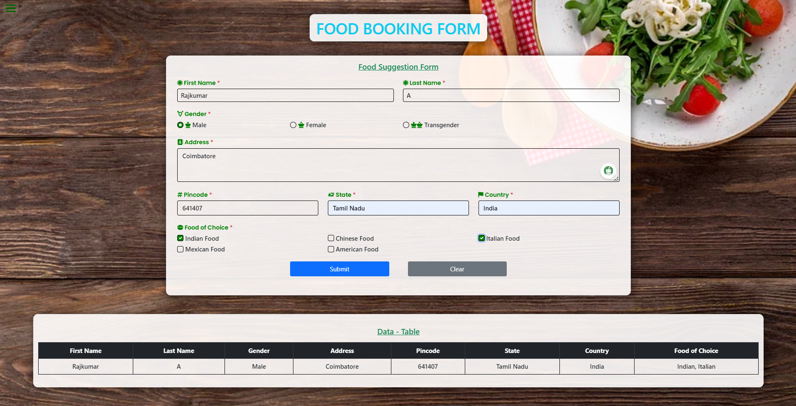

# Registration Form with Table Display

This project demonstrates how to create a registration form using HTML, CSS, and DOM manipulation. Upon submission of the form, the entered values are appended to a table displayed below the form.

## Problem Statement

- **Create a form that includes the following fields:** First Name, Last Name, Address, Pincode, Gender, State, Country, Choice of Food (select at least 2 out of 5 options).
- Upon form submission, the entered values should be appended dynamically to a table.
- After updating the table, the form fields should be cleared for the next entry.

## Technologies Used

- HTML
- CSS
- JavaScript (DOM manipulation)

## Files Included

- `index.html`: Contains the HTML structure of the form and table.
- `styles.css`: Includes basic styling for the form and table.
- `script.js`: JavaScript file for handling form submission and table updates.

## How to Use

1. Clone this repository to your local machine.
2. Open `index.html` in a web browser.
3. Fill out the registration form.
4. Select at least 2 food options from the checkboxes.
5. Submit the form to see the data added to the table.
6. Form fields will automatically clear after submission.

## Conclusion

This project provides a practical example of integrating HTML forms with dynamic table updates using JavaScript. 
By following the steps outlined above, you can easily set up and use this registration form to collect and display user information efficiently.
